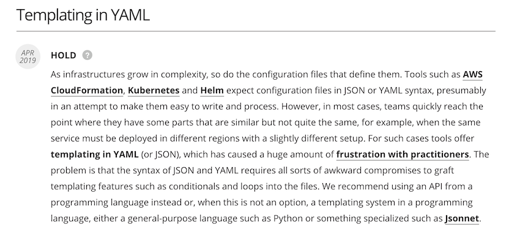
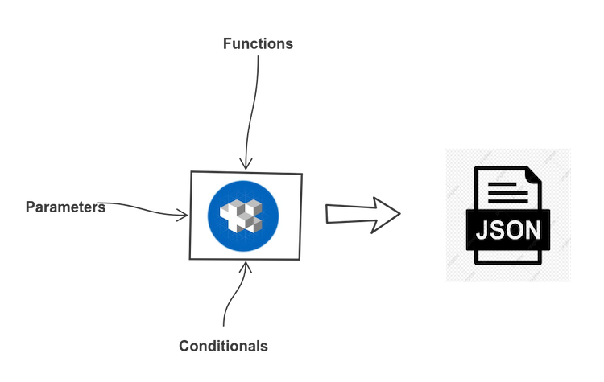

title: Pipelines as Code for Infrastructure at Scale
class: animation-fade
layout: true


<!-- This slide will serve as the base layout for all your slides -->

---

class: impact full-width

.impact-wrapper[
# {{title}}
]

???

Welcome everybody to the last session of the day, I hope you've got still some energy left. I don't think I'll take the full hour so don't worry about that.

The title of this talk is Pipelines as Code for Infrastructure at Scale. There are three elements to this talk.

---

class: center middle

## Pipelines as Code

???

The first part are pipelines as code. I believe many of you are already familiar with this.

--

## for Infrastructure

???

Next are infrastructure pipelines. Provisioning infrastructure in automated pipelines is not super common in my experience.

--

## at Scale

???

Lastly, at scale. I want to talk about the project I've been for the past year. The most unique part of this talk is the fact that at a certain scale, things become complicated. You'll see what I mean by that.

---

class: center middle

## Agenda
### A problem to solve
### An attempt
### The Issue
### What are the options?
### Programmatic pipelines
### Scaling up
### Results
### Takeaways

???

Here is a rough agenda.

---

class: transition

## Mario Fernandez
 
 **Thought**Works
 
---

class: impact

.impact-wrapper[
# A problem to solve
]

???

Let's start from the beginning. What was this project about?

---

class: center middle

## Building our own PaaS

???

We've been at this client for the past few years. Essentially, they tasked us with building a platform as a service

---

class: center middle

## Enable teams to move from on-premise to the cloud

???

The idea is to allow product teams to move to the cloud safely

---

class: center middle

## Layer on top of AWS to provide a ready-to-use solution

???

We're not crazy enough to do it ourselves, so we build on top of AWS

---

class: center middle full-height
background-image: url(images/tech-overview.png)

???

There are a ton of technologies and tools involved. AWS, Kubernetes, monitoring, logging, and whatnot.

---

class: center middle full-width
background-image: url(images/world-map.png)

???

We are deploying to multiple regions. We deploy to Europe, to the US, China and Korea.

---

class: center middle full-width
background-image: url(images/environments.png)

???

If that's not enough, we have multiple environments per region. Let me tell you, big german companies love their environments

---

class: center middle full-height
background-image: url(images/products.png)

???

And if there is not enough complexity yet, we have multiple of these. To isolate teams, we provision all this for teams separately to isolate them

---

class: center middle full-width
background-image: url(images/complexity.jpg)

???

If the point is not clear by not, this a whole lot of complexity

---

class: impact full-width

.impact-wrapper[
# An attempt
]

???

That's the setup. How did we go about _building_ this?

---

class: center middle

## Provisioning a ton of infrastructure


???

All of this is code. That is non-negotiable. A ton of terraform is needed to provision all this infrastructure

---

class: center middle

```console
modules
├── access-from-other-accounts
├── application-environment-1
├── application-environment-2
├── cluster-{backup,management}
├── connected-hosted-zone
├── dispatcher-vpc
├── domain
├── functional-area
├── functional-area-{access,runtime}
├── logging
├── monitoring
├── operations
├── private-egress
├── private-ingress-{app,dispatcher}
└── system-services
```

???

We split this in modules to avoid a gigantic blob. There are a lot of them. Had to squeeze this quite a bit to fit

---

class: center middle

```console
modules/
├── access-from-other-accounts
│   ├── dependencies.tf
│   ├── locals.tf
│   ├── main.tf
│   ├── outputs.tf
│   ├── providers.tf
│   └── variables.tf
├── application-environment-1
│   ├── data.tf
│   ├── locals.tf
│   ├── main.tf
│   ├── outputs.tf
│   ├── providers.tf
│   └── variables.tf
└── tracing
```

???

Each module is very standarized so that we can apply them easily across all these combinations. Terragrunt has been an invaluable tool for us.

---

class: center middle

```console
[terragrunt] 2021/02/01 20:28:39 Executing hook: tflint
[terragrunt] 2021/02/01 20:28:39 Running command: tflint
[terragrunt] 2021/02/01 20:28:40 Running command: terraform apply
module.aws_vpc.module.vpc.aws_subnet.private[2]: Refreshing state..
module.aws_vpc.module.vpc.aws_vpc.this[0]: Refreshing state..
module.aws_vpc.module.vpc.aws_subnet.private[0]: Refreshing state..
module.aws_vpc.module.vpc.aws_subnet.private[1]: Refreshing state..
module.aws_vpc.module.vpc.aws_vpc.this[0]: Refreshing state..
module.aws_eks.data.aws_region.current: Refreshing state..

Apply complete! Resources: 0 added, 0 changed, 0 destroyed.
```

???

We started applying these infrastructure from our own computers

---

class: transition

# Spoiler Alert
## Doing it by hand did not scale

???

That got ouf of hand pretty quickly

---

class: center middle


### thoughtworks.com/radar/techniques/pipelines-for-infrastructure-as-code

???

We use concourse as a CI/CD tool, and that's what I'm going to use in the examples. Any CI/CD tool will probably do.

---

class: center middle

## Apply infrastructure changes automatically

???

The point of using a CI/CD tool is to apply these changes automatically

---

class: center middle

## Small modules

???

Small modules are crucial. Easier to apply, easier to understand, easier to debug

---

class: center middle

## Pipeline is an orchestrator of existing scripts

???

The pipeline doesn't do much more than build the dependencies between different modules and orchestrate the execution of scripts that we can also run locally

---

class: center middle full-width
background-image: url(images/pipeline.png)

???

In the end an infra pipeline will end up looking like this

---

class: impact

.impact-wrapper[
# The issue
]

???

still have plenty of slides left, you can tell this isn't going to be so easy

---

class: center middle

## YAML is really verbose

---

class: center middle

## Like, really

---

class: center middle

## Concourse doesn't help, either

???

Concourse has very explicit definitions of the dependencies between jobs and tasks and resources

---

class: center middle full-width
background-image: url(images/job.png)

???

Let's go over the basic structure of a job in Concourse

You define the inputs, such as git repositories or s3 buckets

Then the job executes a list of tasks, each running some script

This is a linter task for sh, docker, js and shell.

---

class: center middle

```yaml
- name: lint
  serial: true
  plan:
  - in_parallel:
    - get: git
      passed: [prepare]
      trigger: true
    - get: dev-container
      passed: [prepare]
  - in_parallel:
    - task: lint-sh
      image: dev-container
      params:
        <<: *common-params
        TARGET: sh
      file: git/pipeline/tasks/linter/task.yml
```

???

I had to cut out most of it

Each linter is a similar block with a different `TARGET`

---

class: center middle

## Our ability to manage duplication is limited

---

class: center middle

## Anchor parameters

---

class: center middle

```yaml
  - in_parallel:
    - task: lint-sh
      image: dev-container
      params:
*       <<: *common-params
        TARGET: sh
      file: git/pipeline/tasks/linter/task.yml
```

```yaml
common-params: &common-params
  CI: true
```

???

Anchors to reuse blocks

---

class: center middle

## Parametrized tasks

---

class: center middle

```yaml
  - in_parallel:
    - task: lint-sh
      image: dev-container
      params:
        <<: *common-params
*       TARGET: sh
      file: git/pipeline/tasks/linter/task.yml
```

???

Passing parameters to our tasks so that we can reuse the scripts

---

class: center middle

## Now, imagine
### Multiple environments
### Multiple regions

---

class: center middle

## YAML overdose!

???

We tried and the sheer weight of the YAML was too much

Refactorings become really hard

---

class: center middle full-width
background-image: url(images/massive-pipeline.png)

---
class: impact

.impact-wrapper[
# What are the options?
]

---

class: center middle

## Something on top of YAML

---

class: center middle

## Three approaches

---

class: center middle


???

3 buckets

- ad-hoc tools
- dedicated templating languages
- a full-blown programming language

---

class: center middle


???

One of my painfully learned lessons while being at TW: Don't use ad-hoc tools for this

---

class: center middle



---

class: center middle

> We recommend using an API from a programming language, or, a templating system

---

class: impact

.impact-wrapper[
# Programmatic pipelines
]

---

class: center middle

## Generate most of the pipeline automatically

---

class: center middle

## Handle duplication through a parametrized approach

---

class: transition

# Jsonnet

---

class: center middle

### jsonnet.org/

---

class: center middle

## A data templating language for app and tool developers

---

class: center middle



---

class: center middle

## YAML happens to be a superset of JSON

---

class: transition

# Abstract building blocks

???

Three steps

- abstract the structure of a pipeline
- build a DSL
- scale it up

---

class: center middle full-width
background-image: url(images/job-blocks.png)

---

class: center middle

```python
local Parallel(tasks) = {
  in_parallel: tasks
}
```

???

- Think of it as a mixture of _JSON_ and _Python_
- A function that receives one argument and returns a json object with this shape

---

class: center middle

```python
local Job(name, serial = true, plan = []) = std.prune({
  name: name,
  serial: serial,
  plan: plan
})
```

???

- default arguments
- very helpful standard library

---

class: center middle

```javascript
DockerResource(name,
               repository,
               tag = 'latest', allow_insecure = false) = {
  name: name,
  type: 'docker-image',
  source: {
    repository: repository,
    tag: tag
  } + (
    if allow_insecure then {
      insecure_registries: [std.split(repository, '/')[0]]} else {}
  ),
}
```

???

- nested objects
- conditionals

---

class: center middle

### github.com/sirech/concourse-jsonnet-utils

???

You can write tests to prove that your helpers output what you want

---

class: transition

# Building your own DSL

???

First step is to represent the building blocks as helper functions, which removes quite a bit of YAML weight

Next step, a DSL for your own context

---

class: center middle

## Reflect your conventions and idioms in code

???

The previous helpers don't make assumptions about the way you build pipelines

You **should** in fact have plenty of conventions

---

class: center middle

```python
local source = 'git';
local container = 'dev-container';

local Inputs(dependencies = []) = concourse.Parallel(
  [concourse.Get(s, dependencies = dependencies) 
    for s in [source, container]]
);
```
---

class: center middle

```python
local Task(name, file = name, image = container, params = {}) = {
  task: name,
  image: image,
  params: { CI: true } + params,
  file: '%s/pipeline/tasks/%s/task.yml' % [source, file]
};
```

---

class: center middle

## Back to the original example

---

class: center middle

```yaml
- name: lint
  serial: true
  plan:
  - in_parallel:
    - get: git
      passed: [prepare]
      trigger: true
    - get: dev-container
      passed: [prepare]
  - in_parallel:
    - task: lint-sh
      image: dev-container
      params:
        <<: *common-params
        TARGET: sh
      file: git/pipeline/tasks/linter/task.yml
```

---

class: center middle

```python
concourse.Job('lint', plan = [
  Inputs('prepare'),
  concourse.Parallel(
    [Task('lint-%s' % lang, 'linter', params = { TARGET: lang }) 
      for lang in ['sh', 'js', 'css', 'docker']]
  )
]),
```

???

List comprehensions provide a declarative way of looping

Counting the helpers, similar amount of code. But, once you have enough helpers, you leverage them across the entire pipeline(s)

---

class: center middle

### github.com/sirech/example-concourse-pipeline

---

class: impact

.impact-wrapper[
# Scaling up
]

---

class: center middle

## First goal
### Generate one pipeline programmatically

---

class: center middle

## Next goal
### Generate **many** pipelines

---

class: center middle

```yaml
product_name: new-product
version: master

clusters:
  test:
    eu-west-1:
  prod:
    eu-west-1:
    us-east-1:

nodes:
  test:
    instance_type: "m5.large"
  prod:
    instance_type: "c5.2xlarge"
```

???

One pipeline definition

Multiple product definitions that specify the different options


---

class: center middle

```python
local config = std.extVar('CONFIG')
```

---

class: center middle

```console
# Convert the config to JSON and merge it, so that values are overriden
CONFIG="$(yq -r '. * .' ../product_defaults.yaml product.yaml \
         | jq -s 'add')"
```

???

Usually you would load some JSON config

With some trickery, you can use YAML as well

---

class: center middle

```python
local EnvironmentJobs(env) =
  local regions = std.objectFields(config.clusters[env]);
  local params = { ENV: env };
  local services = ['system-services', 'monitoring', 'logging'];

  local modules = [
    Job('cluster-services-%s' % [env], 
        'cluster-global-dns', 
        tasks=[TaskPerRegion(module, regions, params) 
               for module in services]),
  ];

  modules + [
    Job('smoketest-%s' % [env], 
        ['%s' % [module] for module in [job.name for job in modules]], 
        tasks=[TaskPerRegion('smoketest', regions, params)]),
  ]
```

---

class: center middle

## Only works up to a certain point!

---

class: impact

.impact-wrapper[
# Some results
]

???

How does the end result look like?

---

class: center middle full-width
background-image: url(images/job-pipeline.png)

???

Lets start from the inside to the outside

This is how a job looks like, composed by tasks. Notice that we run them for different regions

---

class: center middle full-width
background-image: url(images/environment-pipeline.png)

???

Going up, this is a partial pipeline for a complete environment, like e2e. Divided nicely in modules

---

class: center middle full-width
background-image: url(images/final-pipeline.png)

???

And this is a complete product. You can't read anything there. 

---

class: center middle full-width
background-image: url(images/multiple-pipelines.png)

???

So, what about multiple products? What I like about Concourse is that the dashboard gives you a very good overview of all the pipelines that you have.

---

class: center middle

.col-6[
.table[
| Generated | LOC |
| :------- | ---: |
| pipeline.yaml | 7312 |
]
]

.col-6[
.table[
| Jsonnet | LOC |
| :------- | ----: |
| pipeline.jsonnet | 102 |
| concourse.libsonnet | 54 |
| builders.libsonnet | 46 |
| environments.libsonnet | 19 |
]
]

???

As I said, a simple pipeline might not be worth the effort, but the building blocks compound. Compare the size of both.

---

class: center middle

### hceris.com/templating-concourse-pipelines-with-jsonnet/

---


class: impact

.impact-wrapper[
# Takeaways
]

---

class: center middle

# Use Infrastructure as Code

---

class: center middle

# Use Infrastructure Pipelines

---

class: center middle

# Invest in your tooling

---

---
