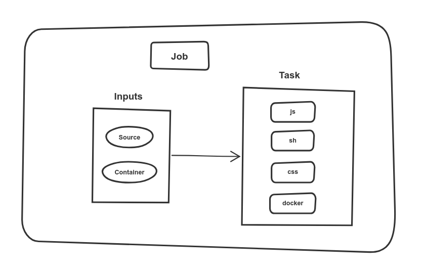

title: Pipelines as Code for Infrastructure at Scale
class: animation-fade
layout: true


<!-- This slide will serve as the base layout for all your slides -->

---

class: impact full-width

.impact-wrapper[
# {{title}}
]

???

I want to talk about our experience pushing pipelines as code to the limit

- Concourse
- jsonnet

Main idea: abstracting the complexity behind delivery pipelines

---

class: center middle

## Agenda
### A problem to solve
### The Issue
### What are the options?
### Programmatic pipelines
### Scaling up
### Results
### Takeaways

---

class: center middle

## Assumption
### You are familiar with delivery pipelines and CI/CD

---

class: transition

## Mario Fernandez
 
 **Thought**Works
 
---

class: impact

.impact-wrapper[
# A problem to solve
]

---

class: center middle

## Enable teams to move from on-premise to the cloud

???

Our project is very infrastructure-heavy

---

class: center middle

## Layer on top of AWS to provide a ready-to-use solution

???

Creating a PaaS, if you will

---

class: center middle full-height
background-image: url(images/tech-overview.png)

---

class: center middle full-width
background-image: url(images/world-map.png)

---

class: center middle full-width
background-image: url(images/environments.png)

???

- Automotive loves its environments

---

class: center middle full-height
background-image: url(images/products.png)

---

class: center middle full-width
background-image: url(images/complexity.jpg)

---

class: center middle

## Provisioning a ton of infrastructure


???

Platform team for enabling others into the cloud

---

class: center middle

```
modules
├── access-from-other-accounts
├── access-to-other-accounts
├── application-environment-1
├── application-environment-2
├── cluster-{backup,management}
├── connected-hosted-zone
├── dispatcher-vpc
├── domain
├── functional-area
├── functional-area-{access,runtime}
├── logging
├── monitoring
├── operations
├── private-egress
├── private-egress-acme
├── private-ingress-{app,dispatcher}
└── system-services
```

???

When I say a lot of infrastructure I really mean it. Had to squeeze this quite a bit to fit

Some of these modules are *really* big

---

class: transition

# Spoiler Alert
## Doing it by hand did not scale

---

class: center middle


### thoughtworks.com/radar/techniques/pipelines-for-infrastructure-as-code

???

Our dirty little secret is that we used to manage it by hand. We realized the futility and started building infra pipelines for it

---

class: center middle

## Apply infrastructure changes automatically

---

class: center middle

## Small modules

---

class: impact

.impact-wrapper[
# The issue
]

---

class: center middle


### thoughtworks.com/insights/blog/modernizing-your-build-pipelines

---

class: center middle

## YAML is really verbose

---

class: center middle

## Like, really

---

class: center middle

## Concourse doesn't help, either

???

Concourse has very explicit definitions of the dependencies between jobs and tasks and resources

---
class: center middle



???

This is a linter task for sh, docker, js and shell.

---

class: center middle

```yaml
- name: lint
  serial: true
  plan:
  - in_parallel:
    - get: git
      passed: [prepare]
      trigger: true
    - get: dev-container
      passed: [prepare]
  - in_parallel:
    - task: lint-sh
      image: dev-container
      params:
        <<: *common-params
        TARGET: sh
      file: git/pipeline/tasks/linter/task.yml
```

???

I had to cut out most of it

Each linter is a similar block with a different `TARGET`

---

class: center middle

## Our ability to manage duplication is limited

---

class: center middle

```yaml
  - in_parallel:
    - task: lint-sh
      image: dev-container
      params:
*       <<: *common-params
        TARGET: sh
      file: git/pipeline/tasks/linter/task.yml
```

???

Anchors to reuse blocks

---

class: center middle

```yaml
  - in_parallel:
    - task: lint-sh
      image: dev-container
      params:
        <<: *common-params
*       TARGET: sh
      file: git/pipeline/tasks/linter/task.yml
```

???

Passing parameters to our tasks so that we can reuse the scripts

---

class: center middle

## YAML overdose!

???

We tried and the sheer weight of the YAML was too much

Refactorings become really hard

---

class: center middle full-width
background-image: url(images/massive-pipeline.png)

---
class: impact

.impact-wrapper[
# What are the options?
]

---

class: center middle

## It was clear we needed a way to programmatically generate parts of the pipeline

---

class: center middle

## Three approaches

---

class: center middle


???

3 buckets

- ad-hoc tools
- dedicated templating languages
- a full-blown programming language

---

class: center middle


???

One of my painfully learned lessons while being at TW: Don't use ad-hoc tools for this

---

class: center middle


---

class: center middle

> We recommend using an API from a programming language, or, a templating system

---

class: impact

.impact-wrapper[
# Programmatic pipelines
]

---

class: center middle

## Generate most of the pipeline automatically

---

class: center middle

## Handle duplication through a parametrized approach

---

class: transition

# Infrastructure modules

---

TODO: what is an infra module

---

TODO: example module

---

class: transition

# Jsonnet

---

class: center middle

### jsonnet.org/

---

class: center middle

## A data templating language for app and tool developers

---

class: center middle


---

class: center middle

## YAML happens to be a superset of JSON

---

class: transition

# Abstract building blocks

???

Three steps

- abstract the structure of a pipeline
- build a DSL
- scale it up

---

class: center middle

```python
local Parallel(tasks) = {
  in_parallel: tasks
}
```

???

- Think of it as a mixture of _JSON_ and _Python_
- A function that receives one argument and returns a json object with this shape

---

class: center middle

```python
local Job(name, serial = true, plan = []) = std.prune({
  name: name,
  serial: serial,
  plan: plan
})
```

???

- default arguments
- very helpful standard library

---

class: center middle

```javascript
DockerResource(name,
               repository,
               tag = 'latest', allow_insecure = false) = {
  name: name,
  type: 'docker-image',
  source: {
    repository: repository,
    tag: tag
  } + (
    if allow_insecure then {
      insecure_registries: [std.split(repository, '/')[0]]} else {}
  ),
}
```

???

- nested objects
- conditionals

---

class: center middle

### github.com/sirech/concourse-jsonnet-utils

???

You can write tests to prove that your helpers output what you want

---

class: transition

# Building your own DSL

???

First step is to represent the building blocks as helper functions, which removes quite a bit of YAML weight

Next step, a DSL for your own context

---

class: center middle

## Reflect your conventions and idioms in code

???

The previous helpers don't make assumptions about the way you build pipelines

You **should** in fact have plenty of conventions

---

class: center middle

```python
local source = 'git';
local container = 'dev-container';

local Inputs(dependencies = []) = concourse.Parallel(
  [concourse.Get(s, dependencies = dependencies) 
    for s in [source, container]]
);
```
---

class: center middle

```python
local Task(name, file = name, image = container, params = {}) = {
  task: name,
  image: image,
  params: { CI: true } + params,
  file: '%s/pipeline/tasks/%s/task.yml' % [source, file]
};
```

---

class: center middle

## Back to the original example

---

class: center middle

```yaml
- name: lint
  serial: true
  plan:
  - in_parallel:
    - get: git
      passed: [prepare]
      trigger: true
    - get: dev-container
      passed: [prepare]
  - in_parallel:
    - task: lint-sh
      image: dev-container
      params:
        <<: *common-params
        TARGET: sh
      file: git/pipeline/tasks/linter/task.yml
```

---

class: center middle

```python
concourse.Job('lint', plan = [
  Inputs('prepare'),
  concourse.Parallel(
    [Task('lint-%s' % lang, 'linter', params = { TARGET: lang }) 
      for lang in ['sh', 'js', 'css', 'docker']]
  )
]),
```

???

List comprehensions provide a declarative way of looping

Counting the helpers, similar amount of code. But, once you have enough helpers, you leverage them across the entire pipeline(s)

---

class: center middle

### github.com/sirech/example-concourse-pipeline

---

class: impact

.impact-wrapper[
# Scaling up
]

---

class: center middle

## First goal
### Generate one pipeline programmatically

---

class: center middle

## Next goal
### Generate **many** pipelines

---

class: center middle

```python
local config = std.extVar('CONFIG')
```

---

class: center middle

```console
# Convert the config to JSON and merge it, so that values are overriden
CONFIG="$(yq -r '. * .' ../product_defaults.yaml product.yaml \
         | jq -s 'add')"
```

???

Usually you would load some JSON config

With some trickery, you can use YAML as well

---

class: center middle

```yaml
product_name: new-product
version: master

clusters:
  test:
    eu-west-1:
  prod:
    eu-west-1:
    us-east-1:

accounts:
  test: "product"
  prod: "product-prod"
```

???

One pipeline definition

Multiple product definitions that specify the different options

---

class: impact

.impact-wrapper[
# Some results
]

---

class: center middle

```python
local EnvironmentJobs(env) =
  local regions = std.objectFields(config.clusters[env]);
  local params = { ENV: env };
  local services = ['system-services', 'monitoring', 'logging'];

  local modules = [
    Job('cluster-services-%s' % [env], 
        'cluster-global-dns', 
        tasks=[TaskPerRegion(module, regions, params) 
               for module in services]),
  ];

  modules + [
    Job('smoketest-%s' % [env], 
        ['%s' % [module] for module in [job.name for job in modules]], 
        tasks=[TaskPerRegion('smoketest', regions, params)]),
  ]
```

---

class: center middle full-width
background-image: url(images/final-pipeline.png)

---

* TODO: picture of multiple pipelines

---

* TODO: picture other repos

---

class: center middle

.col-6[
.table[
| Generated | LOC |
| :------- | ---: |
| pipeline.yaml | 3102 |
]
]

.col-6[
.table[
| Jsonnet | LOC |
| :------- | ----: |
| pipeline.jsonnet | 94 |
| concourse.libsonnet | 54 |
| builders.libsonnet | 40 |
| environments.libsonnet | 19 |
]
]

---

class: center middle

### hceris.com/templating-concourse-pipelines-with-jsonnet/

---


class: impact

.impact-wrapper[
# Takeaways
]

---

class: center middle

# Use Infrastructure as Code

---

class: center middle

# Use Infrastructure Pipelines

---

class: center middle

# Invest in your tooling

---

---
