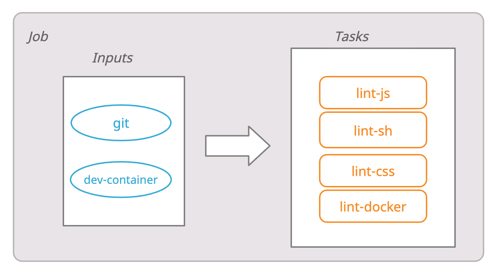

title: Building Pipelines in Concourse using jsonnet
class: animation-fade
layout: true


<!-- This slide will serve as the base layout for all your slides -->

---

class: impact full-width

.impact-wrapper[
# {{title}}
]

---

class: transition

## Mario Fernandez
 
 **Thought**Works
 
---

class: impact

.impact-wrapper[
# A problem to solve
]

---

class: center middle

## Provisioning a ton of infrastructure

---

class: center middle

## Comprehensive
### multiple environments
### multiple regions
### many modules

---

class: center middle

## Multiple products

---

class: impact

.impact-wrapper[
# The issue
]

---

class: center middle

## YAML is really verbose

---

class: center middle

## Like, really

---

class: center middle

## Concourse doesn't help, either

---
class: center middle



---

class: center middle

```yaml
- name: lint
  serial: true
  plan:
  - in_parallel:
    - get: git
      passed: [prepare]
      trigger: true
    - get: dev-container
      passed: [prepare]
  - in_parallel:
    - task: lint-sh
      image: dev-container
      params:
        <<: *common-params
        TARGET: sh
      file: git/pipeline/tasks/linter/task.yml
```

???

This is a linter task for sh, docker, js and shell.

I had to cut out most of it

---

class: center middle

## Our ability to manage duplication is limited

---

class: center middle

```yaml
  - in_parallel:
    - task: lint-sh
      image: dev-container
      params:
*       <<: *common-params
        TARGET: sh
      file: git/pipeline/tasks/linter/task.yml
```

---

class: center middle

```yaml
  - in_parallel:
    - task: lint-sh
      image: dev-container
      params:
        <<: *common-params
*       TARGET: sh
      file: git/pipeline/tasks/linter/task.yml
```

---

class: center middle

## YAML overdose!

---
class: impact

.impact-wrapper[
# What are our options?
]

---

class: center middle

## Dare I say, templating?

---

class: center middle


---

class: center middle


---

class: center middle


---

class: center middle

> We recommend using an API from a programming language, or, a templating system

---

class: impact

.impact-wrapper[
# Jsonnet
]

---

class: center middle

### jsonnet.org/

---

class: center middle

## A data templating language for app and tool developers

---

class: center middle


---

class: center middle

## YAML happens to be a superset of JSON

---

class: impact

.impact-wrapper[
# Utility functions
]

---

class: center middle

```javascript
{
  Parallel(tasks):: {
    in_parallel: tasks
  }
}
```

---

class: center middle

```javascript
{
  Job(name, serial = true, plan = []):: std.prune({
    name: name,
    serial: serial,
    plan: plan
  })
}
```

---
class: center middle

```javascript
{
  DockerResource(name, 
                 repository, 
                 tag = 'latest', allow_insecure = false):: {
    name: name,
    type: 'docker-image',
    source: {
      repository: repository,
      tag: tag
    } + (
      if allow_insecure then { 
        insecure_registries: [std.split(repository, '/')[0]]} else {}
    ),
  }
}
```

---

class: center middle

### github.com/sirech/concourse-jsonnet-utils

---

class: impact

.impact-wrapper[
# Building your own DSL
]

---

own blocks

---

helpers

---

class: center middle

## Back to the original example

---

class: center middle

```yaml
- name: lint
  serial: true
  plan:
  - in_parallel:
    - get: git
      passed: [prepare]
      trigger: true
    - get: dev-container
      passed: [prepare]
  - in_parallel:
    - task: lint-sh
      image: dev-container
      params:
        <<: *common-params
        TARGET: sh
      file: git/pipeline/tasks/linter/task.yml
```

---

class: center middle

```python
concourse.Job('lint', plan = [
  Inputs('prepare'),
  concourse.Parallel(
    [Task('lint-%s' % lang, 'linter', params = { TARGET: lang }) 
      for lang in ['sh', 'js', 'css', 'docker']]
  )
]),
```

---

class: impact

.impact-wrapper[
# Scaling up to multiple pipelines
]

---

class: center middle

## First goal
### Generate one pipeline programmatically

---

class: center middle

## Next goal
### Generate **many** pipelines

---

class: center middle

```python
local config = std.extVar('CONFIG')
```

---

class: center middle

```console
# Convert the config to JSON and merge it, so that values are overriden
CONFIG="$(yq -r '. * .' ../product_defaults.yaml product.yaml \
         | jq -s 'add')"
```

---

class: center middle

```yaml
product_name: new-product
version: master

clusters:
  test:
    eu-west-1:
  prod:
    eu-west-1:
    us-east-1:

accounts:
  test: "product"
  prod: "product-prod"
```

---

class: impact

.impact-wrapper[
# Some results
]

---

class: center middle

```python
local EnvironmentJobs(env) =
  local regions = std.objectFields(config.clusters[env]);
  local params = { ENV: env };
  local services = ['system-services', 'monitoring', 'logging'];

  local modules = [
    Job('cluster-services-%s' % [env], 
        'cluster-global-dns', 
        tasks=[TaskPerRegion(module, regions, params) 
               for module in services]),
  ];

  modules + [
    Job('smoketest-%s' % [env], 
        ['%s' % [module] for module in [job.name for job in modules]], 
        tasks=[TaskPerRegion('smoketest', regions, params)]),
  ]
```

---

class: center middle full-width
background-image: url(images/final-pipeline.png)

---

class: center middle

.col-6[
.table[
| Generated | LOC |
| :------- | ---: |
| pipeline.yaml | 3102 |
]
]

.col-6[
.table[
| Jsonnet | LOC |
| :------- | ----: |
| pipeline.jsonnet | 94 |
| concourse.libsonnet | 54 |
| builders.libsonnet | 40 |
| environments.libsonnet | 19 |
]
]

---

class: center middle

### hceris.com/templating-concourse-pipelines-with-jsonnet/

---
